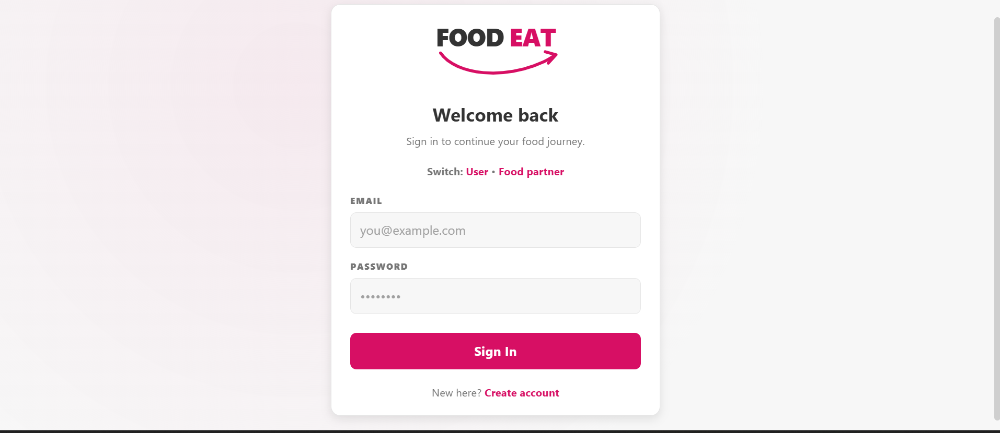
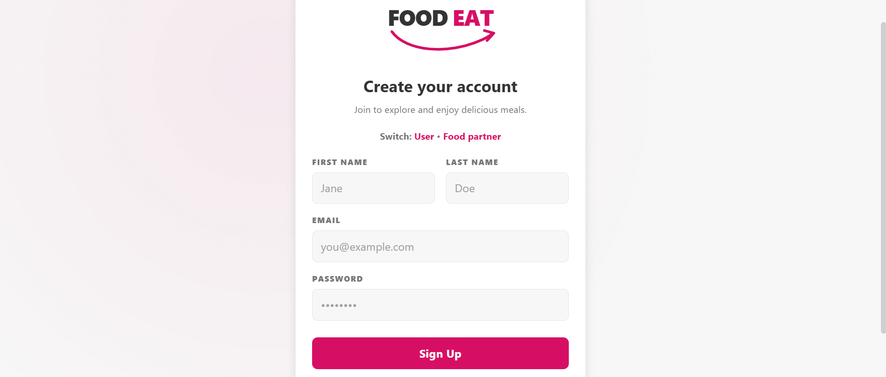
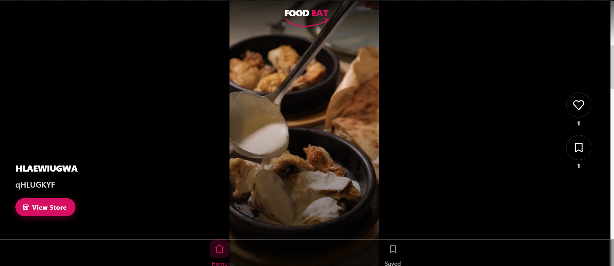
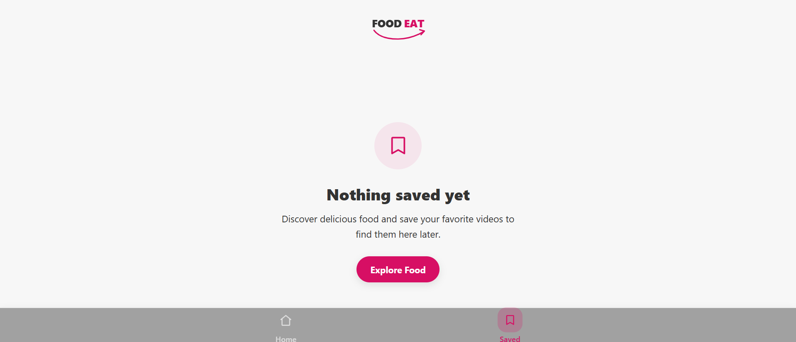
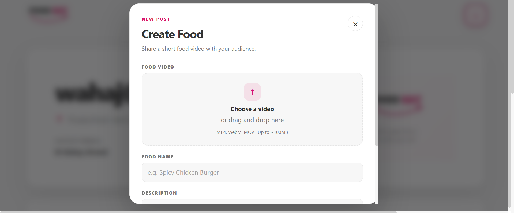
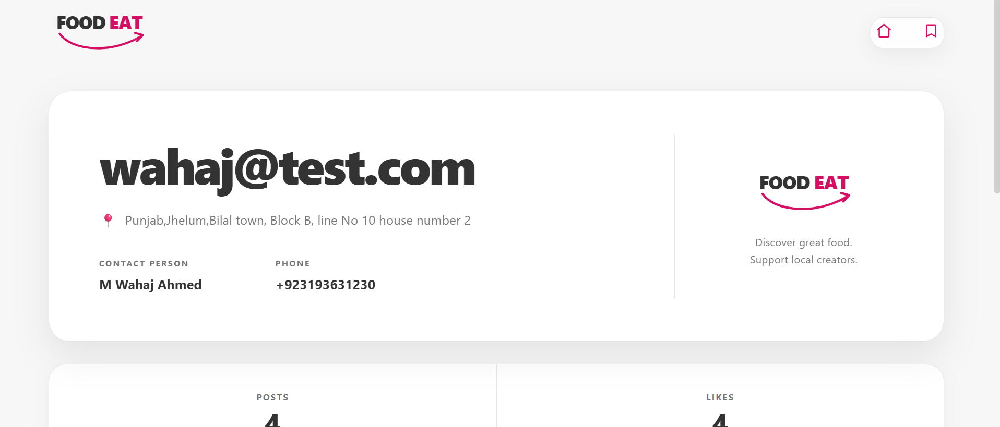

# 🚀 Food View

```{=html}
<p align="center">
```


A full-stack food discovery and video-sharing platform where users can
explore short food videos, like and save their favorites, and visit
food-partner profiles. Food partners can register, upload food videos,
manage their posts, and present their food business through a dedicated
partner panel.


------------------------------------------------------------------------

# 📑 Table of Contents

-   [Project Overview](#-project-overview)
-   [Why This Project?](#-why-this-project)
-   [Key Features](#-key-features)
-   [System Architecture](#-system-architecture)
-   [Application Workflow](#-application-workflow)
-   [Project Structure](#-project-structure)
-   [Technologies Used](#-technologies-used)
-   [API Documentation](#-api-documentation)
-   [Getting Started](#-getting-started)
-   [Environment Variables](#-environment-variables)
-   [Application Screenshots](#-application-screenshots)
-   [Project Documentation](#-project-documentation)
-   [Challenges Faced](#-challenges-faced)
-   [Testing](#-testing)
-   [Deployment](#-deployment)
-   [Future Improvements](#-future-improvements)
-   [Learning Outcomes](#-learning-outcomes)
-   [Contributing](#-contributing)
-   [License](#-license)

------------------------------------------------------------------------

# 📖 Project Overview

Food View is a full-stack MERN application built around short-form food
videos.

The platform has two main types of accounts:

-   **Users** who discover food videos and interact with them.
-   **Food Partners** who represent food businesses and publish/manage
    their food videos.

The user experience is centered around a vertical reel feed similar to
modern short-video platforms. Users can watch food videos, like them,
save them for later, and open the food partner's profile.

Food partners get a dedicated management area where they can view their
profile, upload food videos, and delete their own posts.

The project demonstrates practical full-stack development using React,
Node.js, Express, MongoDB, JWT authentication, ImageKit storage, REST
APIs, responsive UI design, loading states, error handling, and reusable
React components.

------------------------------------------------------------------------

# 🌐 Live Demo

You can explore the application using the live demo below.

🔗 **Live Demo:** https://your-demo-url.com

------------------------------------------------------------------------

## 🚀 Getting Started

### New User?

If you don't have an account yet:

1.  Open the **Register** page.
2.  Choose whether to register as a **User** or **Food Partner**.
3.  Complete the registration form.
4.  The application authenticates the account using a JWT cookie.
5.  Start exploring Food View or managing your food-partner content.

------------------------------------------------------------------------

### Existing User?

Already have an account?

1.  Open the **Login** page.
2.  Choose **User** or **Food Partner** login.
3.  Enter your registered email and password.
4.  Continue to the appropriate part of the application.

------------------------------------------------------------------------

> **Note:** When the application is hosted on a free-tier backend
> service, the backend may go into sleep mode after inactivity. The
> user-side demo notice and food-partner demo alert communicate this
> behavior so a delayed first request is not mistaken for an application
> failure.

------------------------------------------------------------------------

# 💡 Why This Project?

Food discovery is highly visual, and traditional food listing interfaces
do not always provide an engaging way for users to discover new dishes
or businesses.

Food View explores a short-video-first approach by combining:

-   Food video discovery
-   User authentication
-   Food partner accounts
-   Video uploads
-   Cloud video storage
-   Like and save interactions
-   Food partner profiles
-   REST APIs
-   MongoDB data storage
-   Responsive React UI

The goal is to create a simple platform where users can discover food
visually while food businesses can publish their own content.

------------------------------------------------------------------------

# ⭐ Key Features

## 👤 Authentication

-   User Registration
-   User Login
-   User Logout
-   Food Partner Registration
-   Food Partner Login
-   Food Partner Logout
-   Separate User and Food Partner authentication flows
-   JWT-based authentication
-   Cookie-based authentication
-   Password hashing with bcryptjs
-   Authentication middleware for protected APIs
-   Account switching links between User and Food Partner login/register
    pages

------------------------------------------------------------------------

## 🍔 Food Discovery

-   Full-screen vertical food video feed
-   Reel-style scroll snapping
-   Automatic video playback based on visibility
-   Automatic pause for videos outside the active view
-   Looping reel experience
-   Food name and description display
-   Food partner store/profile button
-   Responsive video layout
-   Loading state while food data is being fetched

------------------------------------------------------------------------

## ❤️ Like & Save Features

-   Like food videos
-   Unlike food videos
-   Save food videos
-   Unsave food videos
-   Like counters
-   Save counters
-   Saved videos page
-   Saved videos remain associated with the logged-in user
-   Empty Saved state for users who have not saved anything yet

------------------------------------------------------------------------

## 🏪 Food Partner Features

-   Food Partner registration
-   Food Partner login
-   Food Partner profile
-   View own food posts
-   Upload food videos
-   Add food name and description
-   Cloud video upload using ImageKit
-   Delete owned food videos
-   Automatic cleanup of related likes and saves when a food post is
    deleted
-   Food partner statistics including total posts and total likes
-   Public-facing food partner profile for logged-in users

------------------------------------------------------------------------

## 🎬 Reel Experience

-   Vertical scroll feed
-   Scroll snapping
-   Seamless looping between first and last videos
-   Video autoplay using IntersectionObserver
-   Muted inline video playback
-   Like and save actions directly on the reel
-   Food partner navigation from each reel
-   Separate ReelViewer component for food-partner management
-   Previous/next video navigation in the ReelViewer
-   Delete action in the food-partner ReelViewer

------------------------------------------------------------------------

## 🎨 User Experience

-   Reusable Food View logo component
-   Loading screens
-   Error states
-   Demo notice for the user application
-   Demo alert for the food partner management area
-   Dedicated empty state for Saved videos
-   Responsive layout for mobile and desktop screens
-   Bottom navigation for Home and Saved sections
-   Shared authentication styling
-   Dedicated page styles for different application areas

------------------------------------------------------------------------

# 🏗️ System Architecture

``` text
                         +--------------------------+
                         |      React Frontend      |
                         |       Vite + React       |
                         +------------+-------------+
                                      |
                                  Axios API
                                      |
                                      ▼
                         +--------------------------+
                         |      Express Backend     |
                         |   REST APIs + Auth       |
                         +------------+-------------+
                                      |
                   +------------------+------------------+
                   |                                     |
                   ▼                                     ▼
        +----------------------+              +----------------------+
        |       MongoDB        |              |       ImageKit       |
        | Users, Food, Likes,  |              | Food Video Storage   |
        | Saves & Partners     |              |                      |
        +----------------------+              +----------------------+
                   |
                   ▼
        +----------------------+
        | JWT + Cookie Auth    |
        | User / Food Partner  |
        +----------------------+
```

------------------------------------------------------------------------

# 🔄 Application Workflow

``` text
User / Food Partner
          │
          ▼
Choose Account Type
          │
     ┌────┴─────┐
     ▼          ▼
   User     Food Partner
     │          │
     ▼          ▼
 Register/Login  Register/Login
     │          │
     ▼          ▼
 JWT Cookie    JWT Cookie
     │          │
     ▼          ▼
 Food Feed     Food Partner Panel
     │          │
 ┌───┴────┐    ├── View Profile
 ▼        ▼    ├── Upload Video
Like     Save  └── Delete Video
 │        │
 └───┬────┘
     ▼
 Saved Videos
     │
     ▼
 Food Partner Profile
```

------------------------------------------------------------------------

# 📁 Project Structure

``` text
Food-App

├── backend
│   ├── src
│   │   ├── controllers
│   │   ├── db
│   │   ├── middlewares
│   │   ├── models
│   │   ├── routes
│   │   └── services
│   │
│   ├── server.js
│   ├── package.json
│   └── .env
│
├── frontend
│   ├── public
│   ├── src
│   │   ├── components
│   │   ├── pages
│   │   │   ├── auth
│   │   │   ├── create-food
│   │   │   └── generale
│   │   ├── routes
│   │   ├── styles
│   │   ├── App.jsx
│   │   ├── App.css
│   │   └── main.jsx
│   │
│   ├── package.json
│   └── vite.config.js
│
└── README.md
```

> The repository may contain local development media used while
> building/testing the application. Video/media folders are
> intentionally not documented here because they are not part of the
> application's source architecture.

------------------------------------------------------------------------

# 🛠 Technologies Used

## Backend

-   Node.js
-   Express.js
-   MongoDB
-   Mongoose
-   JWT
-   bcryptjs
-   cookie-parser
-   multer
-   cors
-   dotenv
-   uuid
-   ImageKit Node SDK

------------------------------------------------------------------------

## Frontend

-   React 19
-   Vite
-   React Router DOM
-   Axios
-   CSS
-   CSS Variables / Theme System
-   IntersectionObserver API

------------------------------------------------------------------------

## Development Tools

-   VS Code
-   Postman
-   MongoDB Compass
-   Git
-   GitHub
-   npm

------------------------------------------------------------------------

## Architecture Pattern

The application follows a separated frontend/backend architecture.

``` text
Frontend
   │
   │ Axios
   ▼
REST API Routes
   │
   ▼
Controllers
   │
   ├── Authentication
   ├── Food Operations
   └── Food Partner Operations
   │
   ▼
Models / Services
   │
   ├── MongoDB
   └── ImageKit
```

This separation keeps authentication, business logic, database models,
cloud storage, and UI responsibilities organized independently.

------------------------------------------------------------------------

# 📡 API Documentation

The backend exposes RESTful APIs for authentication, food videos, likes,
saves, and food partner profiles.

------------------------------------------------------------------------

# 🔐 Authentication APIs

  --------------------------------------------------------------------------------------------
  Method       Endpoint                           Description         Authentication
  ------------ ---------------------------------- ------------------- ------------------------
  POST         `/api/auth/user/register`          Register a new user ❌

  POST         `/api/auth/user/login`             Login an existing   ❌
                                                  user                

  POST         `/api/auth/user/logout`            Logout current user ❌

  POST         `/api/auth/foodpartner/register`   Register a food     ❌
                                                  partner             

  POST         `/api/auth/foodpartner/login`      Login a food        ❌
                                                  partner             

  POST         `/api/auth/foodpartner/logout`     Logout current food ❌
                                                  partner             
  --------------------------------------------------------------------------------------------

------------------------------------------------------------------------

## Register User

### Endpoint

``` http
POST /api/auth/user/register
```

### Request Body

``` json
{
    "fullName": "John Doe",
    "email": "john@example.com",
    "password": "12345678"
}
```

------------------------------------------------------------------------

## Login User

### Endpoint

``` http
POST /api/auth/user/login
```

### Request Body

``` json
{
    "email": "john@example.com",
    "password": "12345678"
}
```

------------------------------------------------------------------------

## Register Food Partner

### Endpoint

``` http
POST /api/auth/foodpartner/register
```

### Request Body

``` json
{
    "name": "Food House",
    "contactName": "John Doe",
    "phone": "03001234567",
    "address": "Islamabad, Pakistan",
    "email": "foodhouse@example.com",
    "password": "12345678"
}
```

------------------------------------------------------------------------

## Login Food Partner

### Endpoint

``` http
POST /api/auth/foodpartner/login
```

### Request Body

``` json
{
    "email": "foodhouse@example.com",
    "password": "12345678"
}
```

------------------------------------------------------------------------

# 🍔 Food APIs

  ----------------------------------------------------------------------------
  Method       Endpoint           Description         Authentication
  ------------ ------------------ ------------------- ------------------------
  POST         `/api/food`        Upload/create a     Food Partner
                                  food video          

  GET          `/api/food`        Get all food videos User
                                  with user like/save 
                                  status              

  DELETE       `/api/food/:id`    Delete a food video Food Partner
                                  owned by the        
                                  partner             

  POST         `/api/food/like`   Like or unlike a    User
                                  food video          

  POST         `/api/food/save`   Save or unsave a    User
                                  food video          

  GET          `/api/food/save`   Get saved food      User
                                  videos              
  ----------------------------------------------------------------------------

------------------------------------------------------------------------

## Create Food

### Endpoint

``` http
POST /api/food
```

### Form Data

  Key           Type
  ------------- ------------
  name          Text
  description   Text
  video         Video File

The video is uploaded to ImageKit and its URL/file ID are stored with
the food document in MongoDB.

------------------------------------------------------------------------

## Get Food Feed

### Endpoint

``` http
GET /api/food
```

The response contains food items ordered by creation time and includes
the current user's `isLiked` and `isSaved` status for each item.

------------------------------------------------------------------------

## Like / Unlike Food

### Endpoint

``` http
POST /api/food/like
```

### Request Body

``` json
{
    "foodId": "FOOD_OBJECT_ID"
}
```

The API toggles the user's like and updates the food item's like
counter.

------------------------------------------------------------------------

## Save / Unsave Food

### Endpoint

``` http
POST /api/food/save
```

### Request Body

``` json
{
    "foodId": "FOOD_OBJECT_ID"
}
```

The API toggles the saved state and updates the food item's save
counter.

------------------------------------------------------------------------

## Get Saved Food

### Endpoint

``` http
GET /api/food/save
```

Returns the food videos saved by the authenticated user.

------------------------------------------------------------------------

# 🏪 Food Partner APIs

  --------------------------------------------------------------------------------------
  Method       Endpoint                     Description         Authentication
  ------------ ---------------------------- ------------------- ------------------------
  GET          `/api/foodpartner/profile`   Get current food    Food Partner
                                            partner profile and 
                                            posts               

  GET          `/api/foodpartner/:id`       Get a food partner  User
                                            profile and its     
                                            food posts          
  --------------------------------------------------------------------------------------

------------------------------------------------------------------------

## Get Current Food Partner Profile

### Endpoint

``` http
GET /api/foodpartner/profile
```

Returns partner information, food posts, total posts, and total likes.

------------------------------------------------------------------------

## Get Food Partner By ID

### Endpoint

``` http
GET /api/foodpartner/:id
```

Returns the selected food partner's public information, food posts,
total posts, and total likes.

------------------------------------------------------------------------

# 🚀 Getting Started

## Prerequisites

Before running the project, ensure the following software is installed.

-   Node.js
-   npm
-   MongoDB Atlas or Local MongoDB
-   Git
-   ImageKit account and private key

------------------------------------------------------------------------

## Clone Repository

``` bash
git clone https://github.com/yourusername/food-view.git
```

------------------------------------------------------------------------

## Navigate to Project

``` bash
cd Food-App
```

------------------------------------------------------------------------

# ⚙ Backend Setup

Move into the backend directory.

``` bash
cd backend
```

Install dependencies.

``` bash
npm install
```

Start development server.

``` bash
npm run dev
```

Backend runs on:

``` text
http://localhost:3000
```

------------------------------------------------------------------------

# 💻 Frontend Setup

Open a second terminal and move into the frontend directory.

``` bash
cd frontend
```

Install dependencies.

``` bash
npm install
```

Run development server.

``` bash
npm run dev
```

Frontend runs on:

``` text
http://localhost:5173
```

------------------------------------------------------------------------

# 🔑 Environment Variables

Create a `.env` file inside the **backend** directory.

``` env
PORT=3000

MONGODB_URI=your_mongodb_connection_string

JWT_SECRET=your_secret_key

IMAGEKIT_PRIVATE_KEY=your_imagekit_private_key
IMAGEKIT_PUBLIC_KEY=your_imagekit_public_key
IMAGEKIT_URL_ENDPOINT=your_imagekit_url_endpoint
```

> Never commit real credentials or private keys to GitHub.

------------------------------------------------------------------------

# 📦 Backend Dependencies

The backend uses the following main packages:

``` bash
npm install express mongoose cors dotenv bcryptjs jsonwebtoken cookie-parser multer uuid @imagekit/nodejs
```

------------------------------------------------------------------------

# 📦 Frontend Dependencies

The frontend uses the following main packages:

``` bash
npm install react react-dom react-router-dom axios
```

------------------------------------------------------------------------

# ▶ Running the Project

Open two terminals.

### Terminal 1

``` bash
cd backend
npm run dev
```

### Terminal 2

``` bash
cd frontend
npm run dev
```

Open your browser.

``` text
http://localhost:5173
```

------------------------------------------------------------------------

# 📷 Application Screenshots

Add screenshots of the finished application inside a `screenshots`
folder when publishing the repository.

## Login Page



------------------------------------------------------------------------

## Register Page



------------------------------------------------------------------------

## Home Food Feed


------------------------------------------------------------------------

## Saved Videos


------------------------------------------------------------------------

## Food Partner Panel


------------------------------------------------------------------------

## Food Partner Profile


------------------------------------------------------------------------

# 📂 Project Documentation

The following section provides a detailed explanation of every important
file and directory used throughout the project.

Each file has been documented to make it easier for developers to
understand the overall architecture, responsibilities, and
implementation details.

This documentation is intended for:

-   Developers exploring the project.
-   Recruiters reviewing project quality.
-   Interviewers evaluating architecture decisions.
-   Contributors interested in extending the application.

------------------------------------------------------------------------

# 📂 Project Documentation

This section provides an overview of the major files and folders in the
project. Understanding the responsibility of each file makes it easier
to navigate, maintain, and extend the application.

------------------------------------------------------------------------

# 📁 Backend Documentation

## `.env`

Stores private environment variables used by the backend.

Variables include:

-   MongoDB connection URI
-   JWT secret
-   ImageKit private key
-   ImageKit public key
-   ImageKit URL endpoint
-   Server port

> This file should never be committed to source control.

------------------------------------------------------------------------

## `package.json`

Contains backend project information including:

-   Project metadata
-   Installed dependencies
-   Development dependencies
-   npm scripts

Main scripts:

``` bash
npm run dev
npm start
```

------------------------------------------------------------------------

## `server.js`

The entry point of the backend application.

Responsibilities:

-   Loads environment variables using dotenv.
-   Imports the Express application.
-   Connects to MongoDB.
-   Starts the Express server.
-   Uses port `3000` by default.

------------------------------------------------------------------------

## `src/app.js`

Configures the Express application.

Includes:

-   CORS configuration
-   Cookie parser
-   JSON parsing
-   Authentication routes
-   Food routes
-   Food partner routes

------------------------------------------------------------------------

# 📂 Config Folder

## `db/db.js`

Responsible for establishing the MongoDB connection using Mongoose.

Features:

-   Reads `MONGODB_URI` from environment variables.
-   Connects to MongoDB.
-   Logs successful connection status.
-   Logs connection errors.

------------------------------------------------------------------------

# 📂 Models

## `user.model.js`

Defines the User schema.

Stores:

-   Full name
-   Email
-   Hashed password
-   Created and updated timestamps

------------------------------------------------------------------------

## `foodpartner.model.js`

Defines the Food Partner schema.

Stores:

-   Business name
-   Email
-   Hashed password
-   Phone
-   Address
-   Contact name
-   Created and updated timestamps

------------------------------------------------------------------------

## `food.model.js`

Defines the Food schema.

Stores:

-   Food/video name
-   Description
-   ImageKit video URL
-   ImageKit file ID
-   Food partner reference
-   Like count
-   Save count
-   Created and updated timestamps

------------------------------------------------------------------------

## `likes.model.js`

Stores the relationship between a user and a food video.

Used to determine:

-   Which user liked which food.
-   Whether a current user has already liked a video.
-   Like/unlike operations.

------------------------------------------------------------------------

## `save.model.js`

Stores the relationship between a user and a food video.

Used for:

-   Saving food videos.
-   Unsaving food videos.
-   Retrieving a user's saved videos.

------------------------------------------------------------------------

# 📂 Controllers

## `auth.controller.js`

Handles authentication for both account types.

Responsibilities:

-   Register User
-   Login User
-   Logout User
-   Register Food Partner
-   Login Food Partner
-   Logout Food Partner
-   Password hashing using bcryptjs
-   JWT creation
-   Authentication cookie creation

------------------------------------------------------------------------

## `food.controller.js`

Handles food video operations.

Responsibilities:

-   Create food video
-   Fetch food feed
-   Delete food video
-   Like/unlike food
-   Save/unsave food
-   Fetch saved food
-   Update like and save counters
-   Delete related likes and saves when a food post is removed
-   Upload and delete video files through ImageKit

------------------------------------------------------------------------

## `foodpartner.controller.js`

Handles food partner profile operations.

Responsibilities:

-   Fetch current food partner profile
-   Fetch a food partner by ID
-   Fetch partner food posts
-   Calculate total posts
-   Calculate total likes
-   Validate food partner IDs

------------------------------------------------------------------------

# 📂 Middleware

## `auth.middleware.js`

Protects private backend routes.

Provides two authentication middlewares:

-   `authUserMiddleware`
-   `authFoodPartnerMiddleware`

Functions:

-   Read JWT from the authentication cookie.
-   Verify the JWT.
-   Find the authenticated account in MongoDB.
-   Attach the account to the request.
-   Reject missing, invalid, or expired tokens.

------------------------------------------------------------------------

# 📂 Routes

## `auth.routes.js`

Defines authentication endpoints for both users and food partners.

Routes include:

-   User Register
-   User Login
-   User Logout
-   Food Partner Register
-   Food Partner Login
-   Food Partner Logout

------------------------------------------------------------------------

## `food.routes.js`

Defines food video endpoints.

Routes include:

-   Create Food
-   Get Food Feed
-   Delete Food
-   Like/Unlike
-   Save/Unsave
-   Get Saved Food

Multer memory storage is used for receiving uploaded videos before they
are sent to ImageKit.

------------------------------------------------------------------------

## `foodpartner.routes.js`

Defines food partner profile endpoints.

Routes include:

-   Get Current Food Partner Profile
-   Get Food Partner By ID

------------------------------------------------------------------------

# 📂 Services

## `storage.service.js`

Provides the ImageKit storage layer.

Responsibilities:

-   Upload food videos to ImageKit.
-   Convert uploaded buffers into files for ImageKit.
-   Delete stored videos from ImageKit.
-   Return upload results used by the food controller.

------------------------------------------------------------------------

# 🎨 Frontend Documentation

## `package.json`

Contains frontend dependencies and npm scripts.

Main scripts:

``` bash
npm run dev
npm run build
npm run lint
npm run preview
```

------------------------------------------------------------------------

## `main.jsx`

Frontend entry point.

Responsibilities:

-   Create the React root.
-   Load the main application.
-   Load global application styles.

------------------------------------------------------------------------

## `App.jsx`

Main React application component.

Responsibilities:

-   Load global application styling.
-   Render `AppRoutes`.

------------------------------------------------------------------------

## `App.css`

Contains application-level styling used by the frontend shell.

------------------------------------------------------------------------

## `AppRoutes.jsx`

Defines client-side routing using React Router.

Routes include:

-   Register account selection
-   User Register
-   User Login
-   Food Partner Register
-   Food Partner Login
-   Home
-   Saved Videos
-   Create Food / Food Partner panel
-   Food Partner Profile

------------------------------------------------------------------------

# 📂 Authentication Module

## `ChooseRegister.jsx`

Allows a new account holder to choose between:

-   User registration
-   Food Partner registration

It keeps the account-type selection clear before opening the appropriate
registration form.

------------------------------------------------------------------------

## `UserRegister.jsx`

Handles user registration.

Responsibilities:

-   Collect first and last name.
-   Collect email and password.
-   Send registration data to the backend.
-   Display validation/API errors.
-   Show loading state.
-   Navigate to the user application after successful registration.
-   Provide navigation to User/Food Partner authentication forms.

------------------------------------------------------------------------

## `UserLogin.jsx`

Handles user login.

Responsibilities:

-   Collect email and password.
-   Send credentials to the user login API.
-   Handle invalid credentials.
-   Show loading state.
-   Navigate to the food feed after successful login.
-   Provide links to User and Food Partner login/register flows.

------------------------------------------------------------------------

## `FoodPartnerRegister.jsx`

Handles Food Partner registration.

Collects:

-   Business name
-   Contact name
-   Phone
-   Address
-   Email
-   Password

It sends the information to the Food Partner registration API and
navigates the partner to the management area after successful
registration.

------------------------------------------------------------------------

## `FoodPartnerLogin.jsx`

Handles Food Partner login.

Responsibilities:

-   Collect email and password.
-   Authenticate through the Food Partner login API.
-   Show loading and error states.
-   Navigate to the food partner management panel.
-   Provide links between User and Food Partner authentication pages.

------------------------------------------------------------------------

# 📂 General User Pages

## `Home.jsx`

Main user food discovery page.

Features:

-   Fetches food videos from the backend.
-   Displays videos through `ReelFeed`.
-   Handles like/unlike.
-   Handles save/unsave.
-   Updates like/save counters locally.
-   Shows loading state.
-   Shows the user-side demo notice.

------------------------------------------------------------------------

## `Saved.jsx`

Displays food videos saved by the current user.

Features:

-   Fetch saved food from the backend.
-   Transform saved-food API data for `ReelFeed`.
-   Remove saved videos.
-   Show loading state.
-   Show the dedicated empty Saved experience when no videos are saved.

------------------------------------------------------------------------

# 📂 Food Partner Pages

## `CreateFood.jsx`

Acts as the main food partner management page.

Features:

-   Fetch current food partner profile.
-   Display partner information.
-   Upload food videos.
-   Send video files using `FormData`.
-   Delete food videos.
-   Open videos using `ReelViewer`.
-   Show loading states.
-   Show the food partner demo alert.

------------------------------------------------------------------------

## `Profile.jsx`

Displays a food partner profile to a logged-in user.

Features:

-   Fetch food partner data by ID.
-   Display partner information.
-   Display partner food posts.
-   Show total posts and total likes.
-   Allow users to like partner videos.
-   Allow users to save partner videos.
-   Open partner videos through `ReelViewer`.

------------------------------------------------------------------------

# 📂 React Components

## `BottomNav.jsx`

Provides the mobile-style bottom navigation.

Navigation includes:

-   Home
-   Saved

Uses React Router's `NavLink` to highlight the active page.

------------------------------------------------------------------------

## `ReelFeed.jsx`

The main reusable short-video feed component.

Responsibilities:

-   Render food videos.
-   Implement vertical scroll snapping.
-   Create seamless first/last item looping.
-   Autoplay visible videos.
-   Pause videos outside the active view.
-   Display likes and saves.
-   Navigate to food partner profiles.
-   Display food title and description.

------------------------------------------------------------------------

## `ReelViewer.jsx`

Displays a selected food video in a larger viewer.

Features:

-   Full-screen video viewer.
-   Previous/next navigation.
-   Close button.
-   Like action.
-   Save action.
-   Delete action when provided by the parent.
-   Video counter.
-   Food title and description.

------------------------------------------------------------------------

## `EmptySaved.jsx`

Provides the dedicated empty state for the Saved page.

Displayed when a user has not saved any food videos.

Includes:

-   Saved/bookmark visual indicator.
-   Helpful empty-state message.
-   Explore Food navigation button.

------------------------------------------------------------------------

## `Loading.jsx`

Reusable loading screen component used while API requests or page-level
data are loading.

It keeps loading feedback consistent across the application.

------------------------------------------------------------------------

## `DemoNotice.jsx`

User-side demo notice shown on the food feed.

It explains that the hosted backend may need time to wake up after
inactivity and can be dismissed by the user.

------------------------------------------------------------------------

## `DemoAlert.jsx`

Food Partner-side demo alert used in the management area.

It provides the same hosted-demo context without interrupting the
authentication flow.

------------------------------------------------------------------------

## `FoodViewLogo.jsx`

Reusable Food View brand/logo component used across the application.

------------------------------------------------------------------------

# 🎨 Styling

The project uses regular CSS with shared CSS variables and a theme file.

Styles are organized into:

-   Authentication styles
-   Reel feed styles
-   Reel viewer styles
-   Saved page styles
-   Food partner page styles
-   Profile styles
-   Bottom navigation styles
-   Loading styles
-   Theme variables

------------------------------------------------------------------------

## `theme.css`

Provides shared design variables such as:

-   Background colors
-   Accent colors
-   Typography values
-   Spacing values
-   Shadows
-   Transitions

------------------------------------------------------------------------

## `auth-shared.css`

Contains shared authentication-page styling used by User and Food
Partner forms.

------------------------------------------------------------------------

## `reels.css`

Controls the main short-video feed experience.

Includes styling for:

-   Full-screen reels
-   Video overlays
-   Reel actions
-   Like/save buttons
-   Food partner store button
-   Reel logo overlay
-   Responsive reel actions
-   Demo notice styling

------------------------------------------------------------------------

## `reel-viewer.css`

Styles the larger ReelViewer overlay used by Food Partner and profile
views.

------------------------------------------------------------------------

## `saved.css`

Dedicated styles for the Saved page's empty state.

It keeps Saved-specific styling separate from the reusable ReelFeed
styling.

------------------------------------------------------------------------

## `create-food.css`

Styles the Food Partner food-management page.

------------------------------------------------------------------------

## `profile.css`

Styles the food partner profile page.

------------------------------------------------------------------------

## `bottom-nav.css`

Styles the bottom navigation used by the user application.

------------------------------------------------------------------------

## `loading.css`

Styles the reusable loading screen.

------------------------------------------------------------------------

# 📂 Public Folder

Stores static frontend assets.

Current project assets include:

-   `gemini-svg.svg`

Additional public assets can be added here when required.

------------------------------------------------------------------------

# 📌 Design Principles

This project follows several software engineering principles:

-   Separation of Concerns
-   Component-Based Architecture
-   Reusable React Components
-   RESTful API Design
-   Middleware-Based Authentication
-   Cloud Storage Abstraction
-   Responsive UI Design
-   Reusable Loading and Feedback Components
-   Clean Folder Organization
-   Consistent Styling Through Theme Variables
-   Defensive API Error Handling
-   User-Friendly Empty States

------------------------------------------------------------------------

# 📈 Overall Project Flow

``` text
Frontend
   │
   │ Axios Requests
   ▼
Express Routes
   │
   ▼
Authentication / Controllers
   │
   ├── User Operations
   ├── Food Operations
   └── Food Partner Operations
   │
   ├───────────────┐
   ▼               ▼
MongoDB         ImageKit
   │               │
   └───────┬───────┘
           ▼
       API Response
           │
           ▼
       React UI
```

------------------------------------------------------------------------

# ⚠ Challenges Faced

Developing this project involved solving several practical frontend and
backend engineering challenges.

## Authentication

-   Implemented separate authentication flows for Users and Food
    Partners.
-   Used JWT tokens stored in cookies.
-   Created separate middleware for user and food-partner access.
-   Connected account-type switching directly into login and
    registration pages.
-   Added loading and API error feedback to authentication forms.

------------------------------------------------------------------------

## Video Storage

- Accepted uploaded videos through Multer memory storage.
- Uploaded videos to ImageKit rather than storing large video files
  directly in MongoDB.
- Stored the ImageKit URL and file ID with each food document.
- Added ImageKit deletion when a food partner deletes a post.
- Integrated ImageKit using the CommonJS (`require`) module system,
  following the module-based integration approach provided in the
  official ImageKit Node.js documentation.

------------------------------------------------------------------------

## Reel Feed

-   Built a full-screen vertical video feed.
-   Used scroll snapping to create a reel-style experience.
-   Added first/last clone items to create seamless looping.
-   Used IntersectionObserver to autoplay the active video and pause
    inactive videos.
-   Managed separate video references for cloned reel items.

------------------------------------------------------------------------

## Like and Save System

-   Created separate MongoDB models for likes and saves.
-   Stored user-to-food relationships rather than duplicating
    interaction data.
-   Added toggle behavior for like/unlike and save/unsave.
-   Updated counters in the UI after successful API requests.
-   Cleaned up related likes and saves when a food video is deleted.

------------------------------------------------------------------------

## Frontend Challenges

-   Managing asynchronous API requests.
-   Building reusable reel and viewer components.
-   Keeping the reel experience responsive across devices.
-   Handling loading states without leaving blank pages.
-   Creating useful empty states such as the Saved page.
-   Keeping User and Food Partner authentication visually consistent.
-   Preventing demo notices from appearing repeatedly during
    authentication switching.

------------------------------------------------------------------------

## Backend Challenges

-   Designing RESTful APIs for two account types.
-   Separating user and food partner authentication middleware.
-   Handling MongoDB relationships between users, food, likes, saves,
    and partners.
-   Validating MongoDB ObjectIds before database queries.
-   Managing cloud video storage and deletion.
-   Returning appropriate API errors for invalid requests and
    authentication failures.

------------------------------------------------------------------------

# 🧪 Testing

The application has been manually tested across multiple workflows.

## Authentication

-   User Registration
-   User Login
-   User Logout
-   Food Partner Registration
-   Food Partner Login
-   Food Partner Logout
-   Invalid Credentials
-   Account-Type Switching
-   Loading States
-   API Error Messages

------------------------------------------------------------------------

## User Food Module

-   Food Feed Loading
-   Video Autoplay
-   Reel Scrolling
-   Reel Looping
-   Like Video
-   Unlike Video
-   Save Video
-   Unsave Video
-   Saved Videos Retrieval
-   Empty Saved State
-   Food Partner Profile Navigation

------------------------------------------------------------------------

## Food Partner Module

-   Partner Profile Loading
-   Food Video Upload
-   Food Video Listing
-   Food Video Viewer
-   Previous/Next Video Navigation
-   Like/Save Interaction From Profile
-   Delete Food Video
-   Partner Statistics

------------------------------------------------------------------------

## Backend

-   Authentication Middleware
-   JWT Verification
-   MongoDB CRUD Operations
-   Food Partner Authorization
-   Food Ownership Validation
-   Like/Save Operations
-   ImageKit Upload
-   ImageKit Delete
-   Invalid ObjectId Handling
-   API Error Handling

------------------------------------------------------------------------

## Frontend

-   Form Validation
-   API Integration
-   Navigation
-   Loading States
-   Error Messages
-   Empty States
-   Responsive Layout
-   Reel Interactions
-   Bottom Navigation

------------------------------------------------------------------------

## Tools Used

-   Postman
-   Browser Developer Tools
-   MongoDB Compass
-   npm
-   Git
-   GitHub

------------------------------------------------------------------------

### Troubleshooting

**MongoDB Connection Fails**

-   Verify `MONGODB_URI` is correct.
-   Make sure MongoDB is running when using a local database.
-   Check MongoDB Atlas network access when using Atlas.
-   Verify that the database server is reachable.

**ImageKit Upload Fails**

-   Verify the ImageKit private key.
-   Check the ImageKit URL endpoint.
-   Confirm the backend `.env` file is configured.
-   Check backend logs for the upload error.

**Authentication Fails**

-   Verify `JWT_SECRET` is configured.
-   Make sure the browser allows the authentication cookie.
-   Confirm frontend and backend origins are configured correctly.
-   Check that the correct User or Food Partner login endpoint is being
    used.

**Hosted Demo Takes Time to Respond**

-   The backend may be sleeping on a free hosting tier.
-   Wait for the backend to wake up and try the request again.
-   The application displays a demo notice/alert to explain this
    behavior.

------------------------------------------------------------------------

# ☁ Deployment

The project is designed to be deployed as separate frontend and backend
applications.

## Frontend

Possible platforms:

-   Vercel
-   Netlify

------------------------------------------------------------------------

## Backend

Possible platforms:

-   Render
-   Railway
-   Other Node.js-compatible hosting services

------------------------------------------------------------------------

## Database

-   MongoDB Atlas

------------------------------------------------------------------------

## Storage

-   ImageKit

------------------------------------------------------------------------

## Environment

``` text
Frontend → React + Vite

Backend → Express.js + Node.js

Database → MongoDB

Video Storage → ImageKit

Authentication → JWT + Cookies
```

------------------------------------------------------------------------

# 📈 Performance Considerations

Several practices were followed to improve usability, maintainability,
and performance.

-   Modular folder structure.
-   Reusable React components.
-   Lazy-style page-level data loading through API requests.
-   Video metadata preloading instead of eagerly downloading all video
    content.
-   IntersectionObserver-based video playback.
-   Scroll snapping for controlled reel navigation.
-   Cloud video storage through ImageKit.
-   Separate MongoDB interaction models for likes and saves.
-   Cleanup of related interaction records when food is deleted.
-   Local UI updates after like/save actions to avoid unnecessary
    full-page refreshes.
-   Responsive CSS with mobile and desktop breakpoints.
-   Reusable loading and empty-state components.

------------------------------------------------------------------------

# 🚀 Future Improvements

Future versions of the project may include:

## Food Discovery

-   Search food videos.
-   Food categories.
-   Hashtags.
-   Personalized recommendations.
-   Location-based food discovery.
-   Follow food partners.

------------------------------------------------------------------------

## User Features

-   User profile.
-   Profile picture.
-   Edit profile.
-   Comment system.
-   Share food videos.
-   Notification system.
-   Recently viewed videos.

------------------------------------------------------------------------

## Food Partner Features

-   Edit food posts.
-   Analytics dashboard.
-   Views and engagement statistics.
-   Comment management.
-   Business profile editing.
-   Multiple media formats.
-   Scheduled posts.

------------------------------------------------------------------------

## Technical Improvements

-   Centralized Axios API configuration.
-   Production environment configuration.
-   Automated testing.
-   Integration testing.
-   Rate limiting.
-   API documentation with Swagger.
-   Request logging.
-   Improved caching.
-   Image/video optimization.
-   Pagination or cursor-based feed loading.
-   Better authentication session management.

------------------------------------------------------------------------

# 📚 Learning Outcomes

This project significantly improved my understanding of modern
full-stack web development.

## Backend

-   Express.js
-   MongoDB
-   Mongoose
-   JWT Authentication
-   Cookie Authentication
-   REST API Development
-   Middleware Design
-   File Upload Handling
-   Cloud Storage Integration
-   MongoDB Relationships
-   Error Handling

------------------------------------------------------------------------

## Frontend

-   React 19
-   React Router
-   Axios
-   Component Architecture
-   State Management with React Hooks
-   Responsive CSS
-   Video APIs
-   IntersectionObserver
-   Scroll Snap
-   Loading States
-   Empty States
-   Reusable Components

------------------------------------------------------------------------

## Cloud & Storage

-   ImageKit integration
-   Video upload handling
-   Cloud file deletion
-   Environment variable management

------------------------------------------------------------------------

## Software Engineering

-   Project Architecture
-   Folder Organization
-   Error Handling
-   Clean Code
-   REST API Design
-   Authentication Design
-   Responsive UI Development
-   Git Workflow
-   Documentation
-   Scalability
-   Maintainability

------------------------------------------------------------------------

# 📖 Project Highlights

✔ Full Stack MERN Application

✔ Short-Form Food Video Platform

✔ Separate User and Food Partner Accounts

✔ JWT Authentication

✔ Cookie-Based Authentication

✔ Food Video Uploads

✔ ImageKit Cloud Storage

✔ Food Partner Management Panel

✔ Like / Unlike System

✔ Save / Unsave System

✔ Saved Videos Page

✔ Food Partner Profiles

✔ Reel-Style Video Feed

✔ Seamless Reel Looping

✔ Automatic Video Playback

✔ Responsive User Interface

✔ Loading and Error States

✔ Dedicated Empty Saved State

✔ RESTful APIs

✔ MongoDB Database

✔ Reusable React Components

✔ Mobile-Friendly Navigation

------------------------------------------------------------------------

# 🤝 Contributing

Contributions are welcome.

If you'd like to improve the project:

1.  Fork the repository.

2.  Create a new feature branch.

``` bash
git checkout -b feature/new-feature
```

3.  Commit your changes.

``` bash
git commit -m "Add new feature"
```

4.  Push to GitHub.

``` bash
git push origin feature/new-feature
```

5.  Open a Pull Request.

Every contribution that improves the project, fixes bugs, enhances
documentation, or adds features is appreciated.

------------------------------------------------------------------------

# 📄 License

This project is licensed under the **MIT License**.

You are free to use, modify, and distribute this project for educational
and personal purposes.

------------------------------------------------------------------------

# 👨‍💻 Author

**Muhammed Wahaj Ahmed**

MERN Stack Developer

If you found this project helpful, consider giving it a ⭐ on GitHub.

------------------------------------------------------------------------

# ⭐ Support

If you like this project:

⭐ Star the repository

🍴 Fork the repository

📢 Share it with others

💡 Suggest improvements

Thank you for checking out this project!

------------------------------------------------------------------------


Made with ❤️ using **React, Node.js, Express, MongoDB, and ImageKit**


